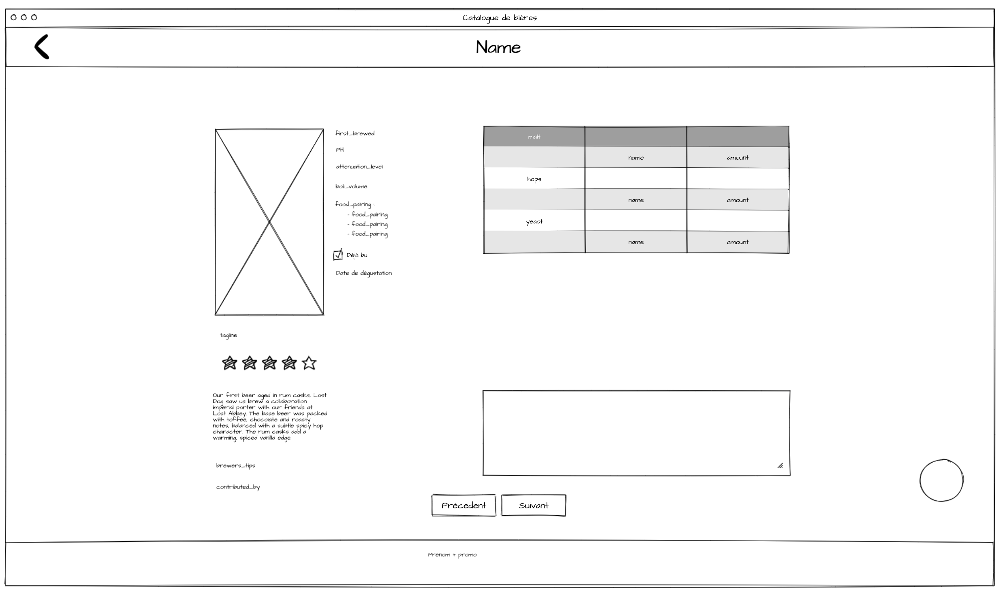

# Participation au projet

- Forker le repo
- Avoir un numéro de bière attribué (:id)
- Créer votre branche (:id-prenom-page-biere)
- Créer VOTRE fichier HTML et CSS vide (suivant la "norme")
- Ajouter vos fichiers, commiter et pusher votre branche
- Créer votre PR
- Se rendre sur l'URL : [https://api.punkapi.com/v2/beers/:id](https://api.punkapi.com/v2/beers/:id)
- Se rendre sur la documentation de [Materialize](https://materializecss.com/)
- Avoir le zooning en vue 
- Intégrer au mieux le zooning

/!\ Faire un commit par composant et pushez à chaque commit !

# Faire une PR

- Avoir un message de commit clair
- Ajouter un screenshot du rendu de l'intégration

# Faire une review

Habituez vous a faire des reviews ! :) Vos PR devrons avoir ma validation ainsi que celle d'un de vos collègue !

# Ne pas oublier

Si vous avez la moindre question, n'hésitez pas : aucune question n'est stupide et si vous vous la pausez, vous n'êtes surement pas le seul :)

Amusez-vous !
